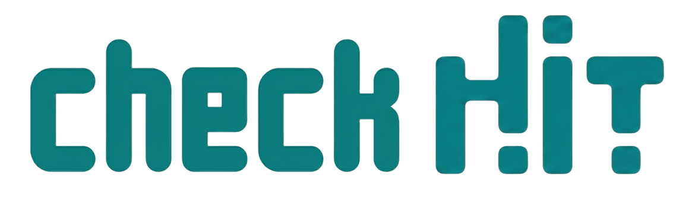

<div align="center">
  
</div>

# Check Hit UI

Check Hit is a modern web application designed for academic environments. It provides separate, tailored portals for students and lecturers to manage courses, assignments, appeals, and system notifications seamlessly. 

The frontend is built with React Router (v7+) and Tailwind CSS, focusing on a responsive, intuitive, and rich user experience that is built from the ground up for RTL (Right-to-Left) Hebrew interfaces.

---

## 🛠️ How to Contribute

We welcome contributions! To help future collaborators get started with the UI project, please follow these steps:

1. **Clone the Repository**
   ```bash
   git clone <repository-url>
   cd checkhit-ui
   ```

2. **Install Dependencies**
   ```bash
   npm install
   ```

3. **Start the Development Server**
   ```bash
   npm run dev
   ```
   The application will be available at `http://localhost:5173`.

4. **Create a Branch & Push Changes**
   - **Important**: Do not commit directly to the `main` branch.
   - Create a new feature branch: `git checkout -b feature/your-feature-name`
   - Commit your changes: `git commit -m "Add your feature"`
   - Push your branch: `git push origin feature/your-feature-name`
   - Open a Pull Request on GitHub to merge into `main`.

---

## 🎨 Design Guidelines

We maintain a consistent, premium aesthetic across the application. When contributing UI components, please adhere to these Tailwind CSS design patterns:

### Brand Colors & Theme
- **Primary Accent**: The main brand color is Teal (`#00857e` and Tailwind's `teal-50` through `teal-700`).
- **Interactive Elements**: Buttons often use `bg-[#00857e] hover:bg-teal-700 text-white transition-colors`.

### Cards & Containers
- **Standard Card**: Most content blocks should use `bg-white rounded-xl border border-gray-200`.
- **Padding**: Standard padding is typically `p-6` or `p-8` for larger sections.
- **Hover States**: For clickable cards (like course items or activity feeds), use `group-hover:border-teal-100 group-hover:bg-teal-50/30 transition-all cursor-pointer`.

### Layout & Direction (RTL)
- Since the interface is Hebrew, **always use logical properties** instead of left/right. 
- Use `ps-*` (padding-start), `pe-*` (padding-end), `ms-*` (margin-start), `me-*` (margin-end) rather than `pl/pr/ml/mr`.
- Use `text-start` or `text-end` instead of `text-left` / `text-right`.

### Typography
- **Headings**: Use `text-gray-900 font-extrabold` for primary titles (e.g., `text-2xl` or `text-4xl`).
- **Body / Subtitles**: Use `text-gray-600 text-base` or `text-lg`.
- **Badges**: Use `text-xs font-bold text-gray-500 whitespace-nowrap bg-gray-100 px-3 py-1 rounded-full`.

### Lists & Activity Feeds
- **Vertical Timelines**: Created using relative positioning and pseudo-elements (`relative before:absolute before:inset-y-0 before:start-5 before:w-0.5 before:bg-gray-100`).
- **List Icons**: Positioned absolutely (`absolute start-[12px] top-1`), often with a rounded background (`w-4 h-4 rounded-full`).

### Animations & Micro-interactions
- **Page Entrances**: Wrap main page content in `animate-in fade-in duration-500`.
- **Icons on Hover**: Wrap icons inside a `.group` container and apply `group-hover:scale-110 transition-transform`.
- **Active States**: Use pulse animations for active/live items (`animate-pulse`).

---
Built with ❤️ using React Router.
